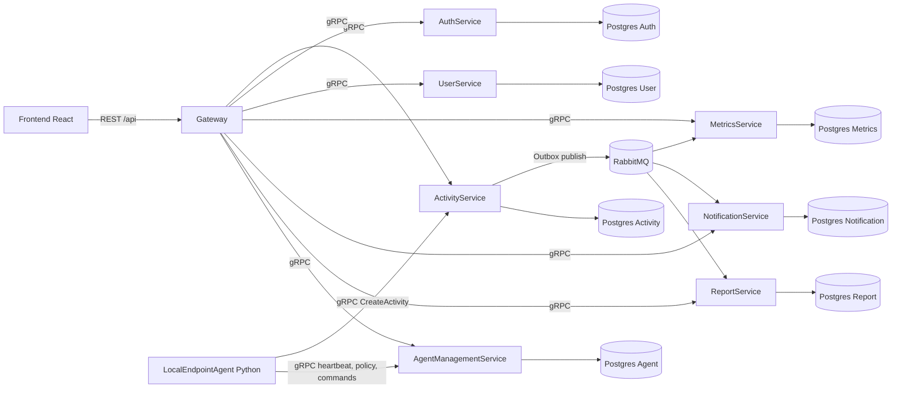

# Activity Monitoring System

Корпоративная система мониторинга активности пользователей на микросервисной архитектуре:
- веб-панель администратора (Dashboard/Analytics/Reports/Settings/Users/Agents),
- backend из gRPC-сервисов за API Gateway,
- событийная синхронизация через RabbitMQ,
- раздельные Postgres базы для каждого доменного сервиса.

## 1. Архитектура



## 2. Состав сервисов и ответственность

### Core backend

1. **Gateway** (`/Backend/gateway/src`)
- Единая REST точка входа для frontend.
- JWT-аутентификация и авторизация.
- gRPC-клиент ко всем backend-сервисам.
- SSE endpoint `/api/live/stream` для live-снапшотов.

2. **AuthService** (`/Backend/services/AuthService`)
- Логин/логаут/регистрация.
- JWT + refresh/session логика.
- Таблицы `auth_users`, `roles`, `sessions`.

3. **UserService** (`/Backend/services/UserService`)
- CRUD пользователей и компьютеров.
- Жестко зафиксированная связь `User ↔ Computer = 1:1` (unique + required).

4. **ActivityService** (`/Backend/services/ActivityService`)
- Прием и хранение активностей.
- Детекция аномалий по правилам (риск, время, повторяемость, URL, процессы и т.д.).
- Outbox-публикация событий в RabbitMQ (`activity.created`, `activity.anomaly-detected`).

5. **MetricsService** (`/Backend/services/MetricsService`)
- Потребление событий из RabbitMQ.
- Агрегации/rollups по активности и аномалиям.
- CRUD метрик и list management (whitelist/blacklist для метрик).

6. **NotificationService** (`/Backend/services/NotificationService`)
- Потребление событий из RabbitMQ и генерация уведомлений.
- Каналы: `in_app`, `email`, `webhook`.
- Inbox-дедупликация обработанных событий.

7. **ReportService** (`/Backend/services/ReportService`)
- Потребление событий из RabbitMQ и проекции для отчетов.
- Daily/range/summary/export API.
- Inbox-дедупликация обработанных событий.

8. **AgentManagementService** (`/Backend/services/AgentManagementService`)
- Control plane для endpoint-агентов:
  - регистрация и статусы агентов,
  - policy CRUD + version history + rollback,
  - команды (pending/running/success/failed/timeout/deadletter),
  - retry/timeout worker и DLQ,
  - sync-batches.

### Агент сбора активности

9. **LocalEndpointAgent (Python)** (`/LocalEndpointAgent`)
- Сбор процессов, браузерной истории, активного окна, idle, сети, файлов, USB и inventory.
- Локальная SQLite-очередь для работы при потере связи.
- Прямой gRPC обмен с `ActivityService` и `AgentManagementService`.
- Получение policy/commands из control-plane и отправка heartbeat health snapshot.

10. **ActivityAgent (C#)** (`/Backend/services/ActivityAgent`)
- Устаревший/demo агент для отправки событий в `ActivityService`.

## 3. Текущий статус LocalEndpointAgent

Папка `/LocalEndpointAgent` содержит рабочую Python-реализацию локального агента:
- регистрация ПК и пользовательской сессии через gateway,
- отправка активности в `ActivityService`,
- heartbeat, policy и commands через `AgentManagementService`,
- локальная очередь и cache policy,
- support для подписанных control-plane payloads (`AGENT_SIGNING_SECRET`).

В production агенту нужны оба секрета:
- `AGENT_AUTH_TOKEN` — gRPC transport auth для прямого доступа к backend-сервисам;
- `AGENT_SIGNING_SECRET` — проверка подписи policy/commands, если backend подписывает control-plane ответы.

## 4. Возможности веб-панели

Пути SPA (`/Frontend/src/App.js`):
- `/dashboard`
- `/agents`
- `/users`
- `/reports`
- `/analytics`
- `/settings`
- `/login`

### Реализовано

1. **Dashboard**
- Оперативные KPI по активности/аномалиям/блокировкам.
- Live-обновление (интервал + SSE-триггеры).

2. **Analytics**
- Аналитика по периодам (daily/weekly/monthly/custom).
- Drill-down и фильтры.
- Автообновление и сохранение пресетов.

3. **Reports**
- Отчеты, тренды, агрегаты по пользователям/департаментам.
- Export через `ReportService`.
- Адаптивные графики (`ResponsiveContainer`).

4. **Users**
- CRUD пользователей.
- Учет связанного компьютера (1:1).

5. **Agents**
- CRUD агентов.
- Просмотр/редактирование policy.
- Версионирование policy + restore.
- Отправка команд (в т.ч. block/unblock).

6. **Settings**
- General/Security/Notification/Monitoring секции.
- CRUD whitelist/blacklist.
- Синхронизация access-листов в policies всех агентов.
- Alert rules CRUD.

7. **Notifications**
- Получение списка, unread count, mark read/read all, delete.

8. **Theme system**
- Light (бело-синяя) и Dark (черно-желтая) темы, переключение в UI.

## 5. Data Flow (как проходят данные)

1. Agent отправляет события активности в `ActivityService` (gRPC).
2. `ActivityService` сохраняет запись в свою БД и проверяет аномалии.
3. Событие кладется в outbox и публикуется в RabbitMQ.
4. `MetricsService`, `NotificationService`, `ReportService` потребляют события и обновляют свои проекции.
5. Frontend читает данные только через `Gateway`, который агрегирует ответы gRPC-сервисов.

## 6. Порты и доступы (docker compose)

### Публичные порты на хосте

| Компонент | Порт(ы) | Назначение |
|---|---:|---|
| Frontend | `3000` | HTTP UI |
| Frontend | `3443` | HTTPS UI (через Nginx/certs) |
| Gateway | `8080` | REST API (`/api/...`) |
| RabbitMQ UI | `127.0.0.1:15672` | Локальная админка RabbitMQ |

### gRPC/REST сервисы

| Сервис | gRPC | REST/HTTP |
|---|---:|---:|
| ActivityService | `5001` | `5002` |
| AuthService | `5003` | `5007` |
| UserService | `5004` | `5005` |
| MetricsService | `5010` | `5011` |
| NotificationService | `5012` | `5017` |
| ReportService | `5013` | `5014` |
| AgentManagementService | `5015` | `5016` |

### Postgres базы

| База | Хост-порт |
|---|---:|
| Activity DB | `5432` |
| Auth DB | `5433` |
| User DB | `5434` |
| Metrics DB | `5435` |
| Notification DB | `5436` |
| Report DB | `5437` |
| Agent DB | `5438` |

## 7. Быстрый старт

### Требования

- Docker + Docker Compose
- для локальной разработки (без контейнеров):
  - .NET SDK **10.0** (для большинства сервисов)
  - .NET SDK **8.0** (для ActivityAgent)
  - Node.js 18+ (frontend)

### Запуск всего стека

```bash
docker compose up --build -d
```

Проверка:

```bash
docker compose ps
docker compose logs -f gateway
```

UI/API:
- Frontend: `http://localhost:3000`
- Gateway health: `http://localhost:8080/health`

### Production-профиль (без внешней публикации внутренних БД/шины/шлюза)

```bash
cp .env.production.example .env.production
# отредактируйте секреты в .env.production
docker compose --env-file .env.production -f docker-compose.yml -f docker-compose.prod.yml up --build -d
```

Примечание:
- внешний доступ идет через `frontend` (`80/443`);
- `gateway`, Postgres и RabbitMQ остаются только во внутренней docker-сети.

### Остановка

```bash
docker compose down
```

## 8. Конфигурация

Ключевые переменные окружения задаются в `docker-compose.yml`:

- `ConnectionStrings__DefaultConnection` для каждого сервиса.
- RabbitMQ параметры:
  - `RABBITMQ_USER`
  - `RABBITMQ_PASS`
  - `RABBITMQ_VHOST`
- агентская gRPC-аутентификация:
  - `AGENT_AUTH_HEADER`
  - `AGENT_AUTH_TOKEN`
- Gateway service discovery:
  - `Services__Activity`, `Services__Auth`, `Services__User`, `Services__Metrics`, `Services__Notification`, `Services__Report`, `Services__Agent`

## 9. Проверка здоровья и диагностика

1. Gateway health:
```bash
curl http://localhost:8080/health
```

2. Логи по сервису:
```bash
docker compose logs -f activityservice
```

3. RabbitMQ UI:
- `http://127.0.0.1:15672`
- логин/пароль из `RABBITMQ_USER` / `RABBITMQ_PASS`

## 10. Backup/Restore БД

Полный backup всех Postgres:

```bash
bash /Users/cukw/FinalWork/scripts/ops/backup_all_postgres.sh
```

Полный restore всех Postgres:

```bash
bash /Users/cukw/FinalWork/scripts/ops/restore_all_postgres.sh /Users/cukw/FinalWork/backups/<timestamp>
```

## 11. Что важно учитывать сейчас

1. `LocalEndpointAgent` (Python/Rust) реализован и вынесен в `/Users/cukw/FinalWork/LocalEndpointAgent`, включая кроссплатформенный installer и упаковку.
2. `ActivityAgent` (C#) оставлен как demo-генератор событий; в production его лучше отключать (см. `docker-compose.prod.yml`).
3. Событийный контур RabbitMQ + outbox/inbox уже реализован и является базой консистентности между сервисами.

## 12. Полезные пути в репозитории

- Gateway: `/Users/cukw/FinalWork/Backend/gateway/src`
- Frontend: `/Users/cukw/FinalWork/Frontend/src`
- ActivityService: `/Users/cukw/FinalWork/Backend/services/ActivityService`
- AgentManagementService: `/Users/cukw/FinalWork/Backend/services/AgentManagementService`
- Docker orchestration: `/Users/cukw/FinalWork/docker-compose.yml`
